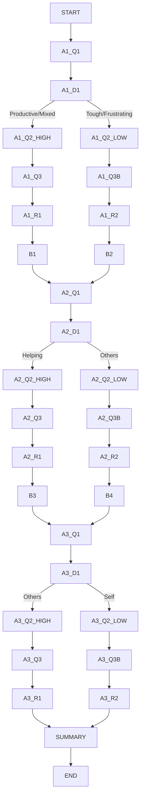

# Reflection Tree Diagram

```mermaid
graph TD

START --> A1_Q1
A1_Q1 --> A1_D1

A1_D1 -->|Productive/Mixed| A1_Q2_HIGH
A1_D1 -->|Tough/Frustrating| A1_Q2_LOW

A1_Q2_HIGH --> A1_Q3
A1_Q2_LOW --> A1_Q3B

A1_Q3 --> A1_R1
A1_Q3B --> A1_R2

A1_R1 --> B1
A1_R2 --> B2

B1 --> A2_Q1
B2 --> A2_Q1

A2_Q1 --> A2_D1

A2_D1 -->|Helping| A2_Q2_HIGH
A2_D1 -->|Others| A2_Q2_LOW

A2_Q2_HIGH --> A2_Q3
A2_Q2_LOW --> A2_Q3B

A2_Q3 --> A2_R1
A2_Q3B --> A2_R2

A2_R1 --> B3
A2_R2 --> B4

B3 --> A3_Q1
B4 --> A3_Q1

A3_Q1 --> A3_D1

A3_D1 -->|Self| A3_Q2_LOW
A3_D1 -->|Others| A3_Q2_HIGH

A3_Q2_HIGH --> A3_Q3
A3_Q2_LOW --> A3_Q3B

A3_Q3 --> A3_R1
A3_Q3B --> A3_R2

A3_R1 --> SUMMARY
A3_R2 --> SUMMARY

SUMMARY --> END
```
